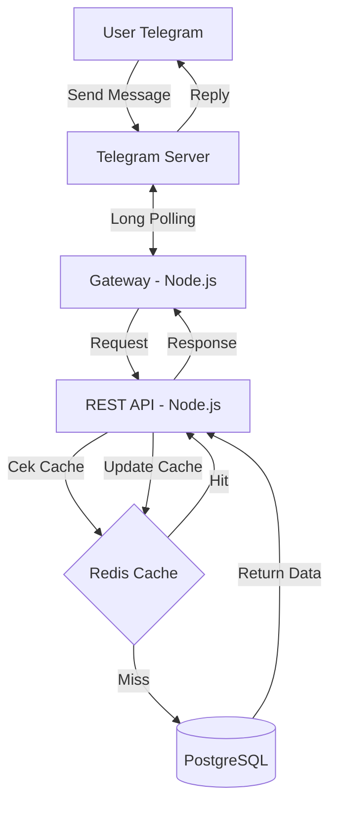

# 🤖 Transaction Notetaker

   

**Pernah ngerasain males nyatet pengeluaran karena harus buka aplikasi ini itu?**
Atau sering lupa beli apa saja hari ini?

Tenang! Kini kamu bisa nyatet transaksi harianmu langsung dari **Telegram**! 🚀

---

## ❓More information

* **Project resource**: [Link](https://drive.google.com/drive/folders/1imuJq2fKhXOnm1cQcX0e4WSuQwinx-LE?usp=sharing)

## ✨ Fitur

### 💰 Manajemen Keuangan Praktis

* **📝 Natural Input**: Input transaksi pakai bahasa sehari hari (NLP Deepseek)
* **⚡ Cache**: Cek transaksi terakhir tanpa loading lama.
* **✏️ Edit & Hapus**: Salah ketik nominal? Typo deskripsi? Tinggal edit atau hapus lewat command.

### 💰 Reminder

* ⏰ Hari-hari bakal diingetin untuk catat transaksimu!

### 🛠️ Tech Stack

* **Node.js**: Core logic bot.
* **Supabase**: Managed PostgreSQL untuk menyimpan data transaksi.
* **Deepseek**: Natural Language Processing untuk memproses *command.*
* **Redis**: Caching layer untuk kurangi beban db.
* **Podman**: Containerized deployment agar mudah dijalankan di VPS mana saja.

---

## 🏗️ Arsitektur Sistem

